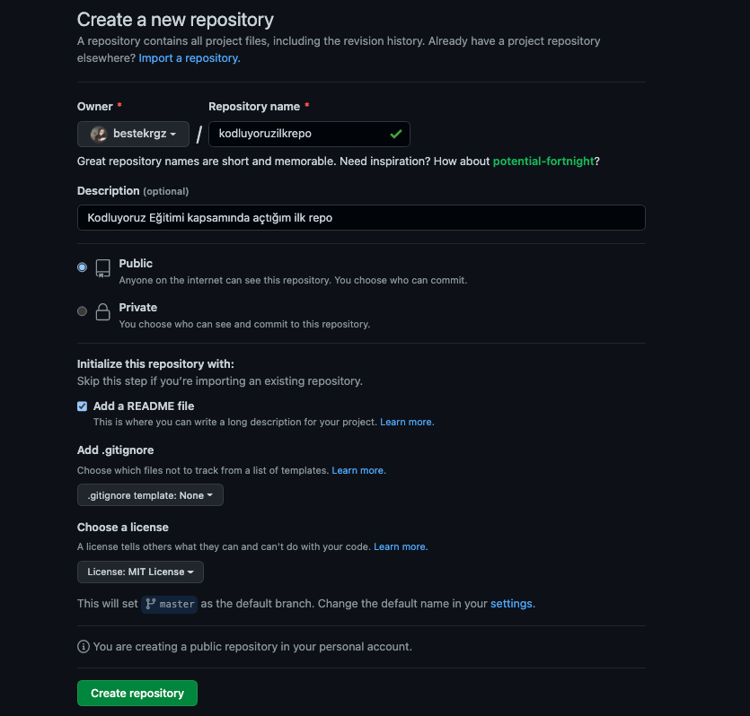

# Installation

<p>Öncelikle projeyi clonelayın. 

```
git clone https://github.com/bestekrgz/kodluyoruzilkrepo.git
```

</p>

# Usage

<p>Projeyi cloneladıktan sonra Visual Studio Code programında açınız.

Linux için:

```
cd kodluyoruzilkrepo
code .
```

</p>

# Contributing

<p>Pull requestler kabul edilir. Büyük değişiklikler için, lütfen önce neyi değiştirmek istediğinizi tartışmak için bir konu açınız.

</p>

# License
[MIT](https://choosealicense.com/licenses/mit/)